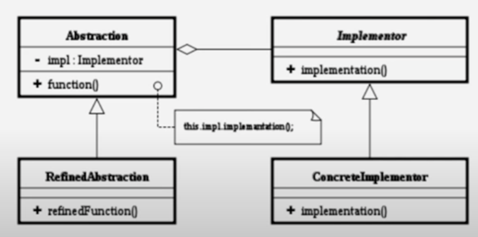
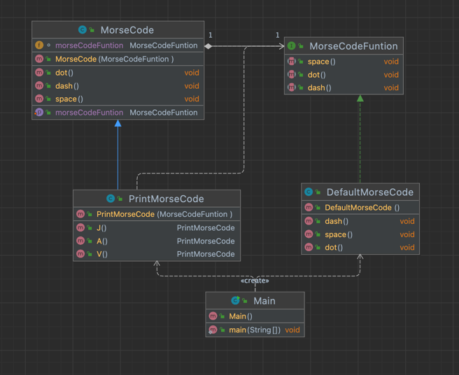

Bridge Pattern

브리지 패턴(Bridge pattern)이란 구현부에서 추상층을 분리하여 각자 독립적으로 변형할 수 있게 하는 패턴이다.
  
- Abstraction : 기능 계층의 최상위 클래스이며, 구현 부분에 해당하는 클래스를 인스턴스를 가지고 해당 인스턴스를 통해 구현부분의 메서드를 호출. 
- RefindAbstraction : 기능 계층에서 새로운 부분을 확장한 클래스 
- Implementor : Abstraction의 기능을 구현하기 위한 인터페이스 정의 
- ConcreteImplementor : 실제 기능을 구현 

