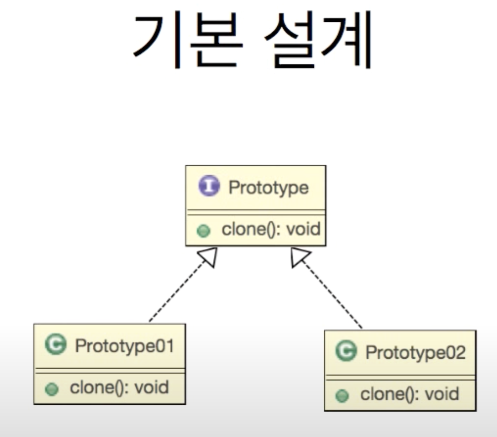
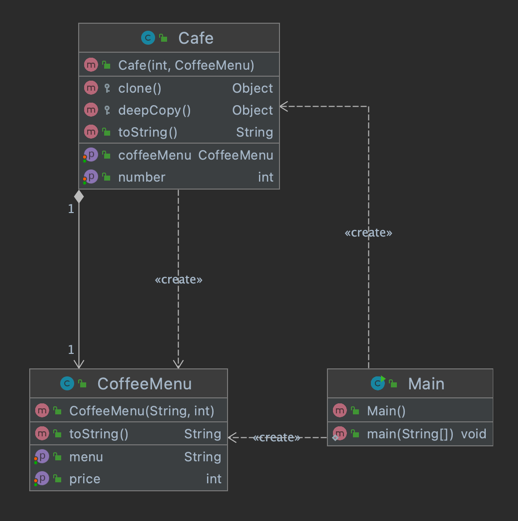

Prototype Pattern

기본적으로 얕은 복사(shallow copy), 깊은 복사(deep copy)에 관한 이해가 필요함.

프로토 타입 패턴을 통해서 복잡한 인스턴스를 복사 할 수 있다.

생산 비용이 높은 인스턴스를 복사를 통해서 쉽게 생성 할 수 있도록 하는 패턴.

JAVA에서는 Cloneable 인터페이스의 clone 메소드를 통해 보다 쉽게 구현 가능.

